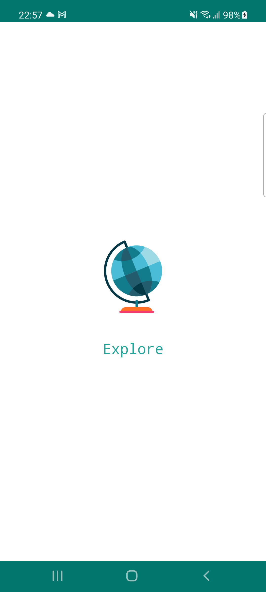
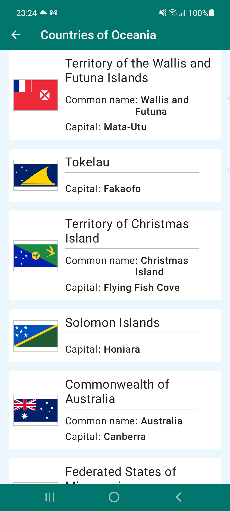

# Countries Explorer
The app shows some useful information about countries around the world.

   

## Overview
The modern Android App development demo using Koin, Coroutines, Jetpack (Compose UI & navigation, ViewModel, Room), and Material design based on MVI-way multimodule architecture.

## Structure
TBA

### Dependency Graph
TBA

 ## Resources
  * API: [REST countries](https://restcountries.com/) from [Public APIs](https://github.com/public-apis/public-apis) repo.
  * Main Icon [resource](https://www.svgrepo.com/svg/131729/earth-globe).
  * ReducibleViewModel inspired by [Komposable-architecture](https://github.com/toggl/komposable-architecture).
  * [Gitmoji](https://gitmoji.dev/) 😏
